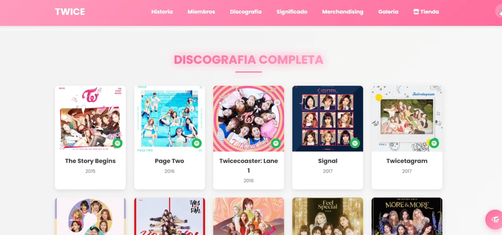
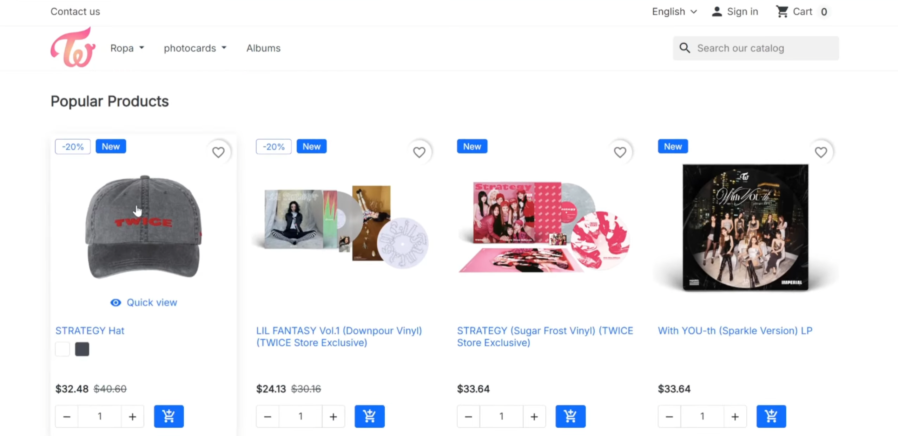
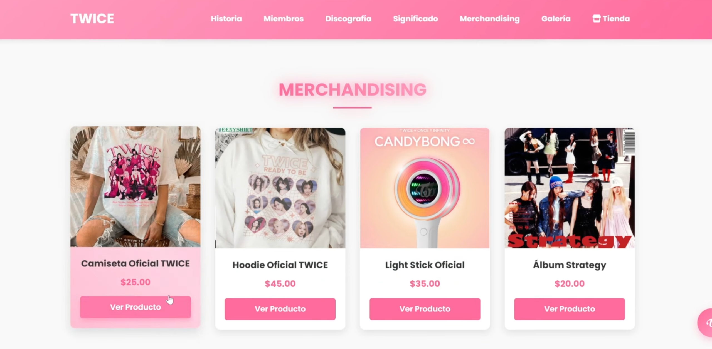

# 🌐 Portafolio de Proyectos Web

¡Hola! Soy estudiante de Ingeniería en Sistemas. En este repositorio documento mis proyectos de infraestructura y diseño web.

---

## 🐳 Infraestructura: E-commerce con Docker
Despliegue de un entorno web completo y escalable utilizando contenedores sobre una Máquina Virtual (Debian 13).

### 🛠️ Tecnologías:
* **Orquestación:** Docker & Docker Compose.
* **Servidor Web:** Apache2.
* **Base de Datos:** MySQL & phpMyAdmin.
* **Tienda:** PrestaShop.

### 📸 Capturas del Proyecto:
A continuación, se muestra la interfaz principal con temática de TWICE y el panel de administración:

---
